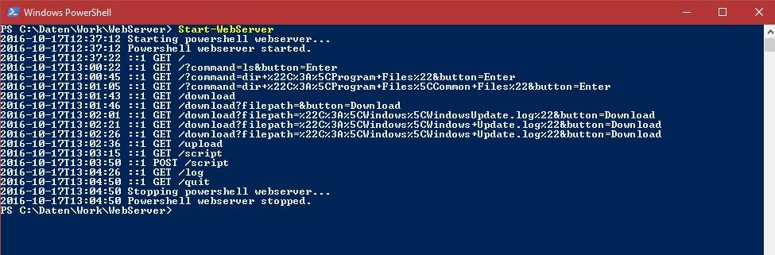
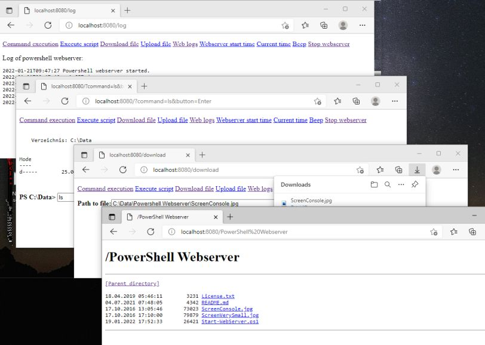
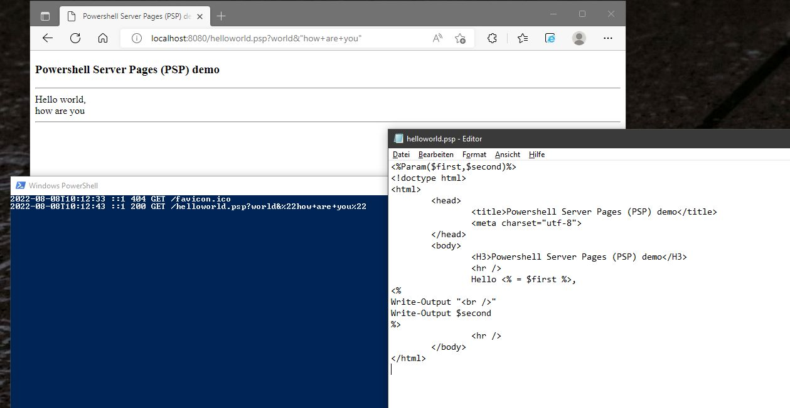

# Powershell Webserver
Powershell WebServer is a module that starts a webserver (without the need for IIS). Powershell command execution, script execution, upload, download and other functions are implemented.

See Script Center version: [Powershell Webserver](https://github.com/MScholtes/TechNet-Gallery).

Author: Markus Scholtes

Module version: 1.0.7 / 2024-02-03

Script version: 1.6 / 2024-01-31

## Installation
Install with
```powershell
Install-Module WebServer
```
or download manually [here](https://www.powershellgallery.com/packages/WebServer/)

Now also on Powershell Gallery as part of the **SysAdminsFriends** module, see [here](https://www.powershellgallery.com/packages/SysAdminsFriends/) or install with
```powershell
Install-Module SysAdminsFriends
```

Project page on github is [here](https://github.com/MScholtes/SysAdminsFriends).

## Description
The .Net class System.Net.HttpListener delivers a basic web service without the need to install a webserver (IIS) role. Since we can use it in C#, we can do it with powershell too (and even without pain).

There are several examples of powershell webservers in the internet, but for me it seems they all have the same origin. Thank you, original coder, whoever you are! My impulse to write a powershell webserver was a short but very impressing example on powershell.com (that unfortunately is no longer online).

The module WebServer implements a webserver with the following functions:
* a powershell command execution web form
* powershell script upload and execution (as a function)
* download files from the server
* upload files to the server
* script execution and embedded code with psp files
* make the webserver beep (to find servers in the datacenter)
* show webserver logs
* show server starttime and current time
* stop the webserver
* deliver static content based on the script's directory if none of the commands above is requested

The webserver responds to GET methods only except the POST upload and download functionalities (implementing this really did hurt).

Other functions can be implemented very easily.

If you give it a try, see remarks below by all means.

## Versions
### 1.0.7 / 2024-02-03
 - parameters can be handed to PSP files per POST method too
 - added wasm extension to mime list

### 1.0.6 / 2023-03-27
 - changed header encoding to Windows 1252 to prevent data loss in cjk encodings
 - fixed bug that cut file names with semicolons in it

### 1.0.5 / 2022-07-31
 - Introduced PSP files (Powershell Server Pages) for embedded execution
 - Updated list of mime types

### 1.0.4 / 2022-04-15
- Logs response code
- Scripts (.ps1, .bat and .cmd) in web directory are executed by web server

### 1.0.3 / 2022-01-19
- Load index file in base dir instead of default page when present

### 1.0.2 / 2021-07-04
- Updated list of mime types

### 1.0.1 / 2021-02-21
- Updated links since Technet Gallery shut down

### 1.0.0 / 2020-06-04
- Initial release

## Examples:
Start webserver with binding to http://localhost:8080/:

```powershell
Start-Webserver
```

Start webserver with binding to all IP addresses of the system and port 8080. Administrative rights are necessary:

```powershell
Start-Webserver "http://+:8080/"
```



Start powershell webserver as scheduled task as user local system every time the computer starts:

```powershell
schtasks.exe /Create /TN "Powershell Webserver" /TR "powershell -Command \"Start-Webserver http://+:8080/\"" /SC ONSTART /RU SYSTEM /RL HIGHEST /F
```

You can start the webserver task manually with
```powershell
schtasks.exe /Run /TN "Powershell Webserver"
```
Delete the webserver task with
```powershell
schtasks.exe /Delete /TN "Powershell Webserver"
```
(Scheduled tasks are always running with low priority, so some functions might be slow)



## Embedded code
You can embed powershell code in html files with psp files ("Powershell Server Pages"). Psp files are html files in which the switch code <% toggles to powershell code and %> toggles back to html. Parameters can be handed per GET or POST.




## Remarks

### Firewall
You may have to configure a firewall exception to allow access to the chosen port, e.g. with:
```powershell
netsh advfirewall firewall add rule name="Powershell Webserver" dir=in action=allow protocol=TCP localport=8080
```

After stopping the webserver you should remove the rule, e.g.:
```powershell
netsh advfirewall firewall delete rule name="Powershell Webserver"
```

### How to enable https encryption
You can also let the **Powershell Webserver** deliver encrypted traffic. For a description look [here](https.md).

### Security
There is no security!!! Once started the webserver can be accessed by everyone and everyone can do on the webserver system what you can do.

### Download / Upload of large files
There is no optimization for large file download or uploads (no chunking or similiar techniques). The transfer of large files might work, or might not.

